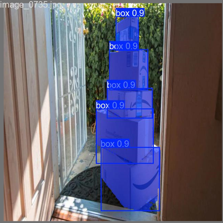
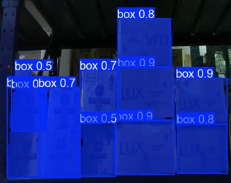
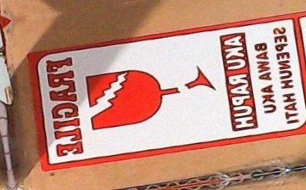
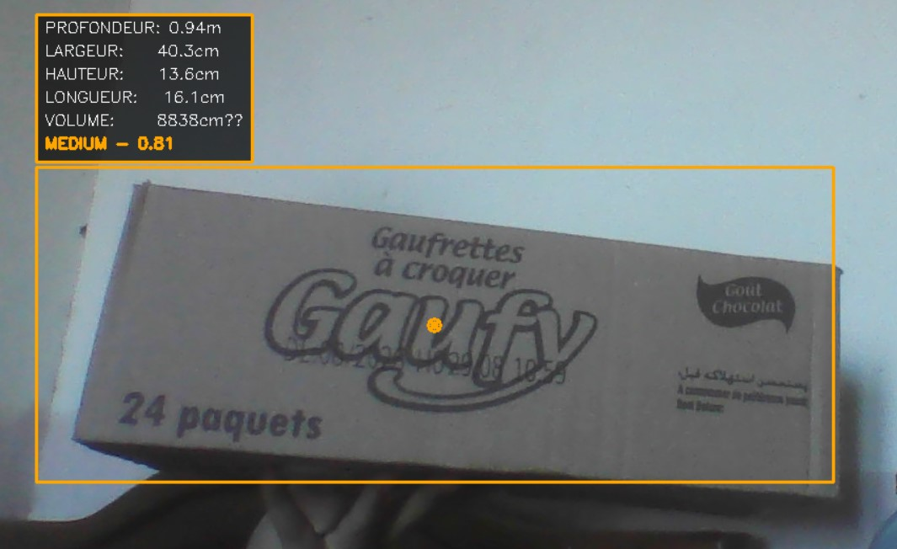

# 📦 LOGIPX: A Robust Multimodal Benchmark for Logistics 4.0


### Status: Production-Ready for Research

LOGIPX (LOGIstic PiXel dataset)is a high-fidelity, multimodal computer vision dataset specifically engineered to meet the industrial and research demands of Logistics 4.0. It provides a comprehensive foundation for developing and benchmarking hybrid AI systems in dynamic warehouse settings, focusing on the core challenges of 3D metrology and semantic classification.

---

## 📜 Table of Contents
* [📈 Core Dataset Statistics](#-core-dataset-statistics)
* [🎯 Benchmark Tasks and Modularity](#-benchmark-tasks-and-modularity)
* [👁️ Data Robustness and Visual Variability](#️-data-robustness-and-visual-variability)
* [🖼️ Visual Data Examples](#️-visual-data-examples)
* [🛠️ Usage & Integration](#️-usage--integration)
* [📝 Citation](#-citation)
* [🤝 Contribution & Support](#-contribution--support)
* [🛡️ License](#-license)

---

## 📈 Core Dataset Statistics

This corpus provides a rigorous testbed for model robustness, featuring precise annotations across three integrated modules.

| Feature | Value | Metric | Logistical Significance |
| :--- | :--- | :--- | :--- |
| Total Images | 8,788 | RGB Images | Scale for large-model training and generalization. |
| Total Annotated Packages | 11,427 | Instances | Volume for Multi-Object Tracking (MOT) and detection. |
| Fragility Classification Set | 14,680 | Instances | Balanced set for semantic decision-making (Fragile/Standard). |
| 3D Metrology Ground Truth | 400 | Images w/ 3D Cuboids | Reference data for depth estimation and volume accuracy. |

---

## 🎯 Benchmark Tasks and Modularity

The dataset is organized into three distinct, yet integrated, modules, allowing researchers to train and evaluate specific components of an end-to-end vision pipeline.

| Module Name | Task Focus | Annotation Types | Primary Models Supported |
| :--- | :--- | :--- | :--- |
| `Geometry_Localization` | Package Localization & Tracking (Detection, Instance Segmentation) | Bounding Box, Instance Mask | YOLOv8-Seg, Faster R-CNN, DeepSORT/ByteTrack |
| `Semantic_Classification` | Fragility Attribute Assignment (Binary Classification) | Image-level Class Label (Fragile/Standard) | YOLOv8-Cls, ResNets, Vision Transformers |
| `3D_Metrology_GT` | Dimensional Measurement (3D Cubing) | 3D Cuboids, Physical Measurements (cm) | Monocular Depth Models (MiDaS), 3D Reconstruction |

### 📂 Repository Structure (Academic Nomenclature)

The file structure is aligned with the modular design:

```

LOGIPX\_DATASET/
├── 3D\_Metrology\_GT/            \# Ground-truth cuboids and real physical measurements (L, W, H in cm).
├── Semantic\_Classification/    \# Classification Data (Input: Isolated package crops).
│   ├── train/                  \# Includes /fragile and /standard subdirectories.
│   ├── valid/
│   └── test/
└── Geometry\_Localization/      \# Detection and Segmentation Data (Input: Full scene images).
│   ├── classes.txt             
│   ├── data.yaml               \# YOLO-style configuration file.
│   ├── train/
│   │    └── images/
│   │    └── labels/             \# Annotation files (YOLO format).
├── valid/
└── test/

````

---

## 👁️ Data Robustness and Visual Variability

The distinct value of LOGIPX lies in its deliberate inclusion of visual degradation and variability, which is necessary for models to generalize beyond laboratory settings.

### 1. Data Collection and Augmentation Strategy

The corpus was built using a dual-source strategy combined with specific synthetic augmentations to target common industrial failures:

* Simulated Realism: Images were captured to reflect the difficult visual landscape of an active sorting facility, focusing on poor image quality conditions.
* Targeted Augmentations: To enhance generalization, the dataset was artificially enriched using the following transformations on the base images:

| Transformation | Range Applied | Purpose and Rationale |
| :--- | :--- | :--- |
| Brightness Variation | Modified between $-24\%$ and $+24\%$ | Simulates extreme illumination shifts (deep shadows vs. high reflections). |
| Motion Blur | Up to $4.8\text{ pixels}$ applied | Prepares models for motion blur caused by high-speed package transport on conveyor belts. |
| Noise Addition | Up to $0.73\%$ of pixels | Replicates sensor noise and poor signal quality under sub-optimal lighting conditions. |
| Rotation | Randomly between $-15^{\circ}$ and $+15^{\circ}$ | Ensures orientation invariance for packages placed obliquely or unaligned. |

### 2. Annotation Quality and Semantic Complexity

* Segmentation Masks: Instance segmentation masks were prioritized over simple bounding boxes to provide precise pixel-level geometry, which is essential for accurate monocular 3D reconstruction and isolating package features from background clutter.
* Visual Packaging Diversity: The dataset includes a wide range of package characteristics to prevent feature over-fitting:
    * Colors & Textures: Variation across brown cardboard, white boxes, plastic mailers, and various printed labels.
    * Surface Conditions: Includes glossy/reflective surfaces (e.g., tape, plastic) and non-textured surfaces (matte cardboard), which typically challenge depth sensors and standard RGB models.
    * Occlusions & Stacking: Contains numerous examples of packages that are partially visible, stacked, or overlapping, testing the models' resilience and tracking capabilities.

---

## 🖼️ Visual Data Examples

These images demonstrate the high-quality annotations and the complex scenarios covered by LOGIPX.
| Image Module | Description | Image Example |
| :--- | :--- | :--- |
| `Geometry_Localization` | Detection in Heavy Clutter: Segmenting individual packages when tightly packed. |  |
| `Geometry_Localization` | Low Light Performance: Robustness against low-contrast and deep shadows. |  |
| `Semantic_Classification` | Fragility Semantic Input: Isolated crop for the binary "Fragile" classifier. |  |
| `3D_Metrology_GT` | Ground Truth Cuboid: Visualization of the 3D cuboid annotation for dimensional accuracy. |  |
| Pipeline Output | Real-time Metrology: Final visualization showing estimated L x W x H dimensions. |  |

---

### 🛠️ Usage & Integration

#### Prerequisites

* Python 3.8+
* PyTorch / TensorFlow
* Essential Libraries: OpenCV, NumPy, Ultralytics YOLO.

#### Example: Training for Instance Segmentation

To train a model using the localization data, ensure your `data.yaml` inside the `Geometry_Localization/` directory is correctly configured:

```powershell
# Example command to train a state-of-the-art model on the Geometric data
yolo segment train data=Geometry_Localization/data.yaml model=yolov8s-seg.pt epochs=50 imgsz=640
````

-----

### 📝 Citation

If you use LOGIPX in your academic or professional work, please cite the Master's thesis that produced this resource:

> Author(s): Achraf Antri
> Title: De la détection à l'estimation dimensionnelle des colis pour la logistique intelligente
> Institution: ENSI (École Nationale des Sciences de l'Informatique)
> Year: 2025


-----

-----

### 🛡️ License

This dataset is released under the Creative Commons Attribution 4.0 International License (CC BY 4.0).

```
